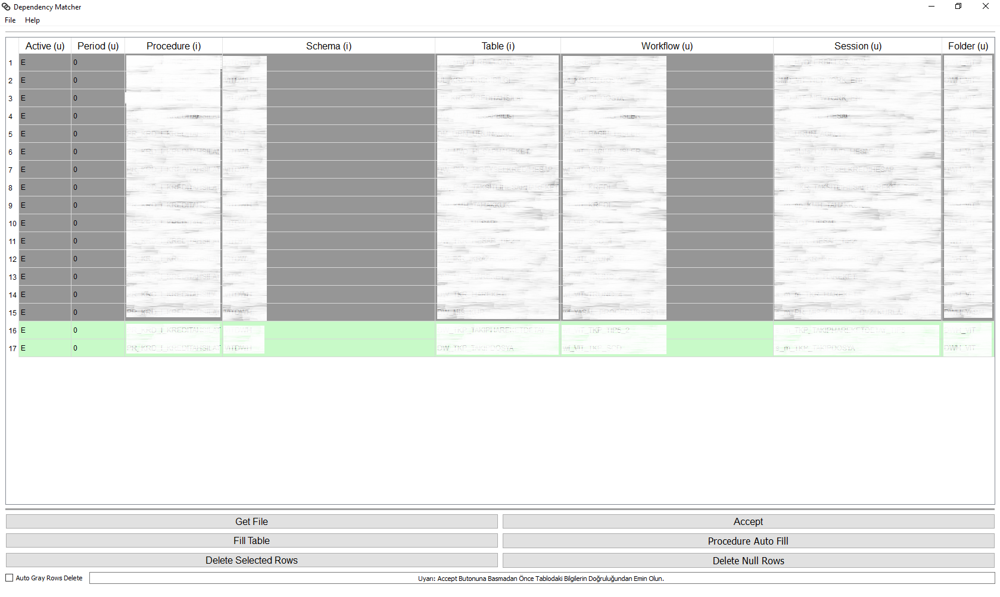
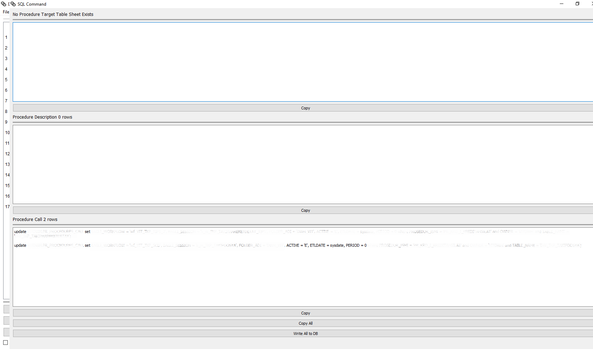

# PyQt-SQL-Generator-Dependency
Application to Create and Execute SQL Commands to Manage The Dependency Between The Jobs in ETL Workflows

This application reads some information about the jobs in ETL in excel format (xlsx or xls). Then it creates SQL queries and has ability to execute these queries to store dependency knowledge between different tasks.

# Motivation
I created this repository to store my work and also make others have an example to work on PyQt. I recommend all that wants to create own UI to use QtDesigner tool.

# Prerequirements
You need to have pyinstaller package and ofcourse python interpreter.

# Build
You need to run 'pyinstaller App.py' command in console and then you need to copy GUI and ICON folders into dist/App directory after you ran the command.

# How to Change
You can change the lines that stated as MASKED in 'App.py'.

# Check
You can find the sample excel file ('Dependency_Sample_Input.xlsx') that you need to have to use this application.

# Language
Main functions in the application is written in English but some parts, especially in hint box, are written in Turkish. All variable and function names are in English.

# Need to Know
There are different colors used to present different states of a row. 

  1) Green is used to state that db has the record and you repeat the row in the input file.

  2) Gray is used to state that db has the record but you didn't repeat the row in the input file.

  3) Yellow is used to state that db has not the record and you give a new row and there are missing columns.

  4) Blue is used to state you filled the missing yellow columns and row is ready to be inserted into db.

You can change the colors and manipulate the rows by using some operations (right click to see).

# Screenshots

After you clicked 'get file' button and selected an input file

After you clicked 'accept' button

